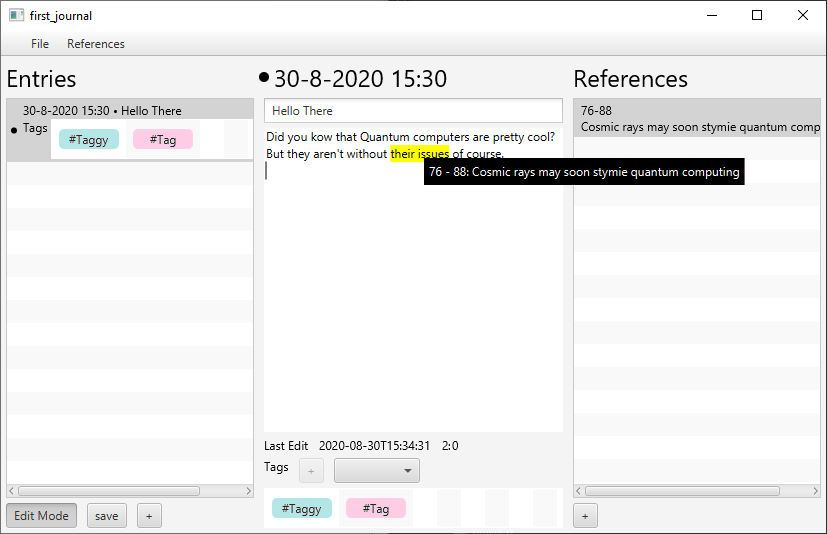

<h1 align="center">
    
     
    📚 Academic Journal
</h1>

    <i>Write every day</i>
     
    
    

Academic Journal is a small journal application meant for researchers where they can take notes on their progress daily.

This is meant to be more akin to a note-taking application with good citation integration, as opposed to most reference
managers, where the focus is much more on the literature itself and less so on the personal notes of the user.

Ideally, being able to quickly go through one's notes and see what has been cited when and why should make it easier to
write a publication as opposed to having to sift through papers to find off-hand notes (possibly without any context
aside from the literature it is citing).
This is not meant as a replacement for reference management tools, simply an addition.
Currently only Zotero is supported.

It would be interesting to also introduce creative visualization of notes, keywords, and citations.
How useful this all will be remains to be seen.
